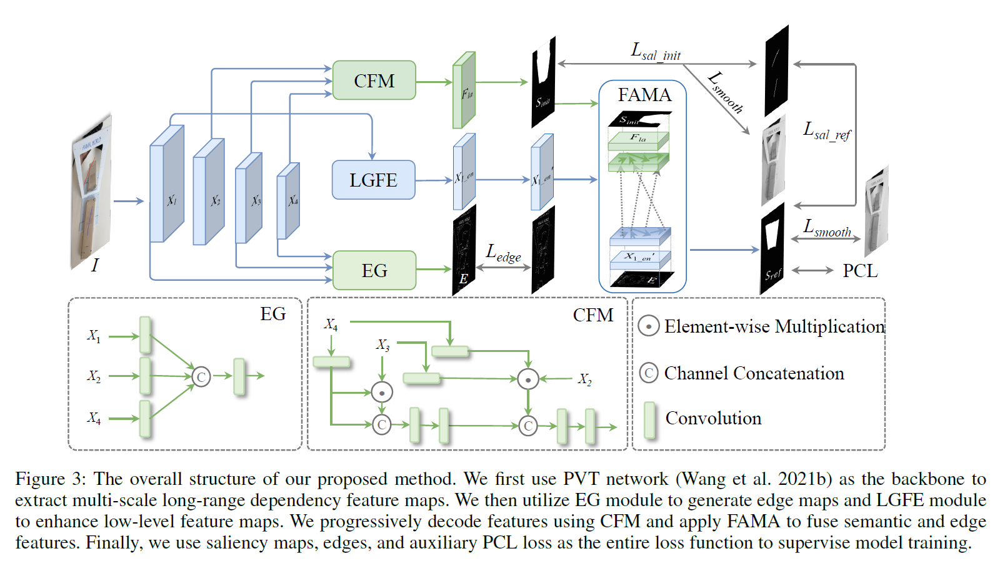
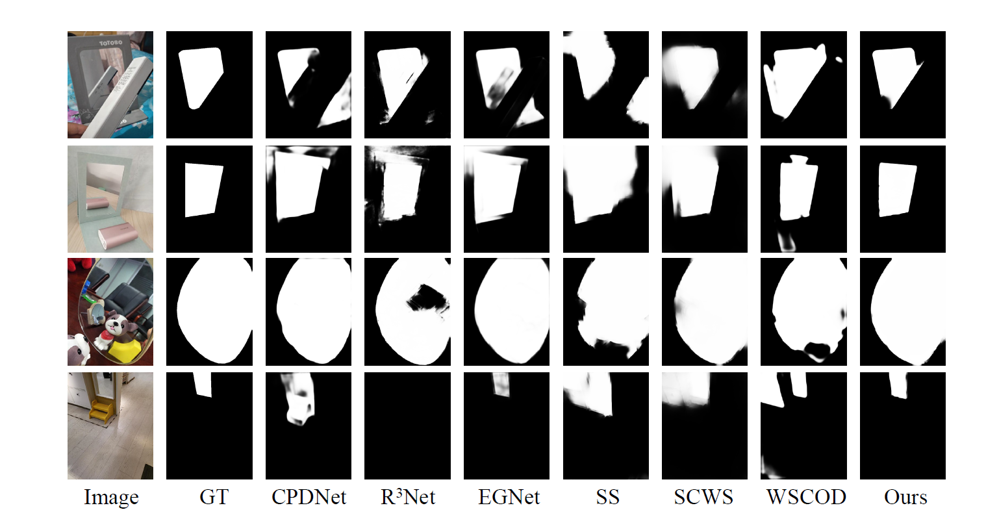

# Weakly-Supervised Mirror Detection via Scribble Annotations (AAAI24)
> Authors: Mingfeng Zha, Yunqiang Pei, and Guoqing Wang
[[Paper Link]](https://ojs.aaai.org/index.php/AAAI/article/view/28521/29016)



## Dataset
- Download the MSD dataset at [here](https://pan.baidu.com/s/1jLZXuJaBxWHaRVW0I_AMqA)(code: dpjo), the PMD dataset at [here](https://pan.baidu.com/s/1bH8ewptDdDpau6PqNd-jXQ)(code: wv18), and the Mirror RGBD dataset at [here](https://pan.baidu.com/s/1esgkjHjL08nwpGOGKOa--w)(code: yx88).

## Experimental Results
- We provide WSMD training weights on [MSD](https://pan.baidu.com/s/15JbB9GzS2AXr68EmIsfqkw)(code: p12b), [PMD](https://pan.baidu.com/s/1nuw989QcNYWIIksRedwGhQ)(code: e6wr) and [Mirror RGBD](https://pan.baidu.com/s/1FSgg4fEklfU5ggphzHJHcw)(code: 9kq0).
- You can download our [detection results](https://pan.baidu.com/s/1jfYFGh1mwES9sfylE9abwg)(code: 1h2g) and [comparison results](https://pan.baidu.com/s/15rSLes38Z5AmB1go4qn7uw)(code: gdes) of other methods.



## Code
### Pretrained weights
- The pretrained weights can be found [here](https://github.com/whai362/PVT/releases/download/v2/pvt_v2_b2.pth).
- Put the downloaded weights under `./preTrainModel/pvt_v2_b2.pth`.

### Train
- Download the dataset and pretrained model.
- Modify the path in `train.py`.
- Run `python train.py`.

### Test and Evaluate
- Modify the path and filename.
- Run `python test.py`.
- Run `python eval.py`.


## Citation
If you find this repo useful for your research, please consider citing our paper:

```
@inproceedings{zha2024weakly,
  title={Weakly-Supervised Mirror Detection via Scribble Annotations},
  author={Zha, Mingfeng and Pei, Yunqiang and Wang, Guoqing and Li, Tianyu and Yang, Yang and Qian, Wenbin and Shen, Heng Tao},
  booktitle={Proceedings of the AAAI Conference on Artificial Intelligence},
  volume={38},
  number={7},
  pages={6953--6961},
  year={2024}
}
```